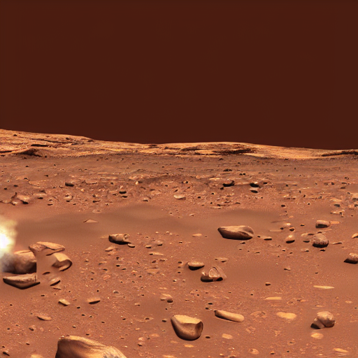

# Stable Diffusion on a CPU

[](https://colab.research.google.com/github/bacalhau-project/examples/blob/main/model-inference/stable-diffusion/index.ipynb)
[](https://mybinder.org/v2/gh/bacalhau-project/examples/HEAD?labpath=model-inference/stable-diffusion/index.ipynb)

[Stable Diffusion](https://github.com/CompVis/stable-diffusion) is a state of the art text-to-image model that generates images from text and was developed as an open source alternative to [DALL·E 2](https://openai.com/dall-e-2/). It is based on a [Diffusion Probabilistic Model](https://arxiv.org/abs/2102.09672) and uses a [Transformer](https://arxiv.org/abs/1706.03762) to generate images from text.

This example demonstrates how to use stable diffusion on a CPU and run it on the [Bacalhau](https://www.bacalhau.org/) network. The first section describes the development of the code and the container. The section section demonstrates how to run the job using [Bacalhau](https://www.bacalhau.org/).

The following image is an example generated by this model.

### TL;DR

```bash
bacalhau docker run ghcr.io/bacalhau-project/examples/stable-diffusion-cpu:0.0.1 -- python demo.py --prompt "cod in space" --output ../outputs/cod.png
```


## 1. Development

The [original](https://github.com/CompVis/stable-diffusion) text-to-image stable diffusion model was trained on a fleet of GPU machines, at great cost. To use this trained model for inference, you also need to run it on a GPU.

However, this isn't always desired or possible. One alternative is to use a project called [OpenVINO](https://docs.openvino.ai/latest/index.html) from Intel that allows you to convert and optimise models from a variety of frameworks (and ONNX if your framework isn't directly supported) to run on a [supported](https://docs.openvino.ai/latest/openvino_docs_OV_UG_Working_with_devices.html) Intel CPU. This is what we will do in this example.

:::tip
Heads up! This example takes about 10 minutes to generate an image on an average CPU. Whilst this demonstrates it is possible, it might not be practical.
:::

### Prerequisites

In order to run this example you need:

* A Debian-flavoured Linux (although you [might be able](https://github.com/bfirsh/stable-diffusion/tree/apple-silicon-mps-support) to get it working on M1 macs)
* [Docker](https://docs.docker.com/get-docker/)


### Converting Stable Diffusion to a CPU Model Using OpenVINO

The first step is to convert the trained stable diffusion models so that they work efficiently on a CPU using OpenVINO. The example is quite complex, so we have created a [separate repository](https://github.com/js-ts/stable_diffusion.openvino) (which is a fork from Github user [Sergei Belousov](https://github.com/bes-dev/stable_diffusion.openvino)) to host the code. In summary, the code:

* Downloads a [pre-optimized OpenVINO version](https://huggingface.co/bes-dev/stable-diffusion-v1-4-openvino) of ...
* the [original](https://huggingface.co/CompVis/stable-diffusion-v1-4) pre-trained stable diffusion model ...
* which also leverages OpenAI's [CLIP transformer](https://huggingface.co/openai/clip-vit-large-patch14) ...
* and is then wrapped inside an OpenVINO runtime, which reads in and executes the model.

The core code representing these tasks can be found [in the `stable_diffusion_engine.py` file](https://github.com/js-ts/stable_diffusion.openvino/blob/master/stable_diffusion_engine.py). This is a mashup that creates a pipeline necessary to tokenize the text and run the stable diffusion model. This boilerplate could be simplified by leveraging the more recent version of the [diffusers library](https://github.com/huggingface/diffusers). But let's crack on.

### Install Dependencies

Note that these dependencies are only known to work on Ubuntu-based x64 machines.


```bash
sudo apt-get update
sudo apt-get install -y libgl1 libglib2.0-0 git-lfs
```

### Clone the Repository and Dependencies

The following commands clone the example repository, other required repositories, and installs the Python dependencies.


```bash
git clone https://github.com/js-ts/stable_diffusion.openvino
cd stable_diffusion.openvino
git lfs install
git clone https://huggingface.co/openai/clip-vit-large-patch14
git clone https://huggingface.co/bes-dev/stable-diffusion-v1-4-openvino
pip3 install -r requirements.txt
```

### Generating an Image

Now that we have all the dependencies installed, we can call the `demo.py` wrapper, which is a simple CLI, to generate an image from a prompt.


```python
!cd stable_diffusion.openvino && \
  python3 demo.py --prompt "hello" --output hello.png
```


```python
import IPython.display as display
display.Image("stable_diffusion.openvino/hello.png")
```


    

    


```python
!cd stable_diffusion.openvino && \
  python3 demo.py --prompt "cat driving a car" --output cat.png
```


```python
import IPython.display as display
display.Image("stable_diffusion.openvino/cat.png")
```


    

    


## 2. Running Stable Diffusion (CPU) on Bacalhau

Now we have a working example, we can convert it into a format that allows us to perform inference in a distributed environment.

First we will create a `Dockerfile` to containerize the inference code. The Dockerfile [can be found in the repository](https://github.com/js-ts/stable_diffusion.openvino/blob/master/Dockerfile), but is presented here to aid understanding.

```Dockerfile
FROM python:3.9.9-bullseye

WORKDIR /src

RUN apt-get update && \
    apt-get install -y \
    libgl1 libglib2.0-0 git-lfs

RUN git lfs install

COPY requirements.txt /src/

RUN pip3 install -r requirements.txt

COPY stable_diffusion_engine.py demo.py demo_web.py /src/
COPY data/ /src/data/

RUN git clone https://huggingface.co/openai/clip-vit-large-patch14
RUN git clone https://huggingface.co/bes-dev/stable-diffusion-v1-4-openvino

# download models
RUN python3 demo.py --num-inference-steps 1 --prompt "test" --output /tmp/test.jpg
```

This container is using the `python:3.9.9-bullseye` image and the working directory is set. Next the Dockerfile installs the same dependencies from earlier in this notebook. Then we add our custom code and pull the dependent repositories.

We've already pushed this image to GHCR, but for posterity, you'd use a command like this to update it:

```bash
docker buildx build --platform linux/amd64 --push -t ghcr.io/bacalhau-project/examples/stable-diffusion-cpu:0.0.1 .
```

### Prerequisites

To run this example you will need:

* [Bacalhau](https://www.bacalhau.org/) installed and running

### Generating an Image Using Stable Diffusion on Bacalhau

[Bacalhau](https://www.bacalhau.org/) is a distributed computing platform that allows you to run jobs on a network of computers. It is designed to be easy to use and to run on a variety of hardware. In this example, we will use it to run the stable diffusion model on a CPU.

To submit a job, you can use the Bacalhau CLI. The following command passes a prompt to the model and generates an image in the outputs directory.

:::tip

This will take about 10 minutes to complete. Go grab a coffee. Or a beer. Or both. If you want to block and wait for the job to complete, add the `--wait` flag.

Furthermore, the container itself is about 15GB, so it might take a while to download on the node if it isn't cached.

:::


```bash
bacalhau docker run ghcr.io/bacalhau-project/examples/stable-diffusion-cpu:0.0.1 --id-only -- python demo.py --prompt "First Humans On Mars" --output ../outputs/mars.png
```


Running the commands will output a UUID that represents the job that was created. You can check the status of the job with the following command:


```bash
bacalhau list --id-filter ${JOB_ID}
```

     CREATED   ID        JOB                      STATE      VERIFIED  PUBLISHED               
     14:14:05  ff7b104d  Docker jsacex/stable...  Completed            /ipfs/QmWxg6CXqZhjAa... 


Wait until it says `Completed` and then get the results.

To find out more information about your job, run the following command:


```bash
bacalhau describe ${JOB_ID}
```

    APIVersion: V1alpha1
    ClientID: 77cf46c04f88ffb1c3e0e4b6e443724e8d2d87074d088ef1a6294a448fa85d2e
    CreatedAt: "2022-10-13T14:14:05.447388688Z"
    Deal:
      Concurrency: 1
    ExecutionPlan:
      ShardsTotal: 1
    ID: ff7b104d-0736-434e-8e5f-dc47c457cbf5
    JobState:
      Nodes:
        QmYgxZiySj3MRkwLSL4X2MF5F9f2PMhAE3LV49XkfNL1o3:
          Shards:
            "0":
              NodeId: QmYgxZiySj3MRkwLSL4X2MF5F9f2PMhAE3LV49XkfNL1o3
              PublishedResults:
                CID: QmWxg6CXqZhjAagQVxqopwhyXMHAHvTFKXYtWjzc7BJp65
                Name: job-ff7b104d-0736-434e-8e5f-dc47c457cbf5-shard-0-host-QmYgxZiySj3MRkwLSL4X2MF5F9f2PMhAE3LV49XkfNL1o3
                StorageSource: IPFS
              RunOutput:
                exitCode: 0
                runnerError: ""
                stderr: "ftfy or spacy is not installed using BERT BasicTokenizer instead
                  of ftfy.\n\r0it [00:00, ?it/s]\r1it [00:05,  5.26s/it]\r2it [00:09,
                  \ 4.95s/it]\r3it [00:14,  4.96s/it]\r4it [00:19,  4.84s/it]\r5it [00:24,
                  \ 4.92s/it]\r6it [00:29,  4.83s/it]\r7it [00:34,  4.84s/it]\r8it [00:39,
                  \ 4.84s/it]\r9it [00:43,  4.78s/it]\r10it [00:48,  4.78s/it]\r11it [00:53,
                  \ 4.77s/it]\r12it [00:58,  4.78s/it]\r13it [01:02,  4.76s/it]\r14it
                  [01:07,  4.77s/it]\r15it [01:12,  4.81s/it]\r16it [01:17,  4.94s/it]\r17it
                  [01:22,  4.92s/it]\r18it [01:27,  4.93s/it]\r19it [01:32,  4.91s/it]\r20it
                  [01:37,  4.90s/it]\r21it [01:42,  4.87s/it]\r22it [01:46,  4.81s/it]\r23it
                  [01:51,  4.81s/it]\r24it [01:56,  4.76s/it]\r25it [02:01,  4.80s/it]\r26it
                  [02:05,  4.71s/it]\r27it [02:10,  4.65s/it]\r28it [02:14,  4.56s/it]\r29it
                  [02:18,  4.52s/it]\r30it [02:23,  4.60s/it]\r31it [02:28,  4.60s/it]\r32it
                  [02:32,  4.62s/it]\r32it [02:32,  4.78s/it]"
                stderrtruncated: false
                stdout: ""
                stdouttruncated: false
              State: Completed
              Status: 'Got results proposal of length: 0'
              VerificationResult:
                Complete: true
                Result: true
        QmdZQ7ZbhnvWY1J12XYKGHApJ6aufKyLNSvf8jZBrBaAVL:
          Shards:
            "0":
              NodeId: QmdZQ7ZbhnvWY1J12XYKGHApJ6aufKyLNSvf8jZBrBaAVL
              PublishedResults: {}
              State: Cancelled
              VerificationResult: {}
    RequesterNodeID: QmXaXu9N5GNetatsvwnTfQqNtSeKAD6uCmarbh3LMRYAcF
    RequesterPublicKey: CAASpgIwggEiMA0GCSqGSIb3DQEBAQUAA4IBDwAwggEKAoIBAQCehDIWl72XKJi1tsrYM9JjAWt3n6hNzrCA+IVRXixK1sJVTLMpsxEP8UKJI+koAWkAUuY8yi6DMzot0owK4VpM3PYp34HdKi2hTjzM8pjCVb70XVXt6k9bzj4KmbiQTuEkQfvwIRmgxb2jrkRdTpZmhMb1Q7StR/nrGa/bx75Vpupx1EYH6+LixYnnV5WbCUK/kjpBW8SF5v+f9ZO61KHd9DMpdhJnzocTGq17tAjHh3birke0xlP98JjxlMkzzvIAuFsnH0zBIgjmHDA1Yi5DcOPWgE0jUfGlSDC1t2xITVoofHQcXDjkHZE6OhxswNYPd7cnTf9OppLddFdQnga5AgMBAAE=
    Spec:
      Docker:
        Entrypoint:
        - python
        - demo.py
        - --prompt
        - First Humans On Mars
        - --output
        - ../outputs/mars.png
        Image: ghcr.io/bacalhau-project/examples/stable-diffusion-cpu:0.0.1
      Engine: Docker
      Language:
        JobContext: {}
      Publisher: Estuary
      Resources:
        GPU: ""
      Sharding:
        BatchSize: 1
        GlobPatternBasePath: /inputs
      Verifier: Noop
      outputs:
      - Name: outputs
        StorageSource: IPFS
        path: /outputs


If you see that the job has completed and there are no errors, then you can download the results with the following command:


```bash
rm -rf results && mkdir -p results
bacalhau get $JOB_ID --output-dir results
```

    Fetching results of job 'ff7b104d-0736-434e-8e5f-dc47c457cbf5'...

After the download has finished you should 
see the following contents in results directory:


```bash
ls results/volumes/outputs
```

    mars.png


```python
import IPython.display as display
display.Image("results/volumes/outputs/mars.png")
```


    

    


